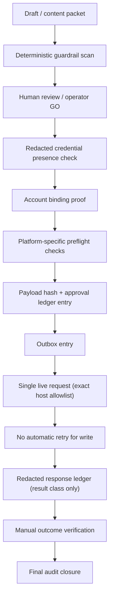

# Supervised Social Publishing Reference Architecture (0174EA)

Task: TASK_CONTENTOPS_0174EA_SOCIAL_AUTOMATION_RESEARCH_AND_ARCHITECTURE_CONTEXT_PACK_V0
Mode: Implementation Mode, docs-only.
Status: Reference architecture for roadmap direction. No live posting code, credential reads, OAuth execution, scheduler, browser automation, or network behavior is introduced by this document.

## Strategic Posture

- Manual posting is **fallback / emergency / manual-public** path, **not** the strategic build target.
- **Autonomous posting is forbidden.** No background bot publishes without a human.
- **Supervised automation is the product direction.** Every side-effecting write requires explicit operator GO bound to an approved payload.

## Pipeline (Required)

```text
Draft / content packet
  -> deterministic guardrail scan
  -> human review / operator GO
  -> redacted credential presence check
  -> account binding proof
  -> platform-specific preflight checks
  -> payload hash + approval ledger entry
  -> outbox entry
  -> single live request with exact host allowlist
  -> no automatic retry for side-effecting writes
  -> redacted response ledger
  -> manual outcome verification
  -> final audit closure
```



## Component Models

### Account Binding Model
- Binds an approved payload to an exact destination: platform, account handle/class, channel/page id (class or redacted), and intended visibility.
- Wrong-account detection: a write must fail closed if the resolved account does not match the bound account.
- Binding is recorded in the approval ledger entry and is part of the payload hash inputs.

### Credential Handle Model
- The control flow references a **credential handle** (symbolic), never a credential value.
- Presence checks return only symbolic classes: `configured` / `not_configured` / `unknown`. No value, no hash, no prefix/suffix, no fingerprint.
- Live secret hydration (future) is operator-owned, short-lived, in-memory, zero-logged, and disposed immediately after a request. Env/file/DB persistence is treated as a weaker fallback, not the default.

### Payload Hash Model
- A deterministic hash over the exact content + destination + account binding + visibility + platform.
- Operator GO is bound to this hash. If the payload changes, the approval expires automatically (fail closed).

### Approval Ledger Model
- One immutable entry per post attempt: operator identity, destination, account binding, payload hash, approval time window/expiry, result class, redacted evidence.
- No raw payload secrets or tokens are ever written to the ledger.

### Outbox Queue Model
- An approved+hashed payload becomes a single outbox entry.
- The outbox holds at most one pending live request per approval. No fan-out, no auto-scheduling of new public posts.
- Manual/supervised drain only; no background auto-publish loop.

### Idempotency Model
- Each outbox entry carries an idempotency key.
- Default for side-effecting writes: one intentional request, fail closed.
- Safe-retry exception only where the provider supports a native idempotency key on the write endpoint (e.g. Mastodon `Idempotency-Key`).

### Request Budget Model
- Per-run request budget is exactly 1 for a live write unless a future gate raises it explicitly.
- No implicit batching of live writes.

### Retry Policy
- **No automatic retry for side-effecting writes.** A failure surfaces to a human who decides.
- Read-only/preflight calls may follow platform best-practice backoff, but never silently retry a content-creating write.

### Rate / Spend Policy
- Hard spend cap below the platform billing limit for paid platforms (X first).
- Telegram paid broadcast (`allow_paid_broadcast`) defaults OFF.
- Discord: parse route/global rate headers and stop on exhausted buckets.
- TikTok/YouTube: explicit `audit_complete_public` vs `private_test_only` readiness state, never assumed public.

### Platform Preflight Model
- Per-platform validators, not one generic publish: scope checks, account-role requirements, media readiness (LinkedIn asset URNs), creator-info (TikTok), blob upload (Bluesky), subreddit post-requirements (Reddit), visibility constraints (TikTok/YouTube).

### Fake-Provider Test Harness
- Deterministic fake providers for every platform.
- Required test cases: token-missing, wrong-account, invalid-scope, rate-limited, redirect-mismatch, audit-not-approved, duplicate-submit.
- CI never runs with live provider secrets and never snapshots `.env`.

### Redacted Audit Model
- Store only result classes and redacted evidence (status class, timestamps, payload hash, account binding class).
- Never store raw responses, tokens, or full payloads.

### Kill Switch
- A single explicit control that blocks all live dispatch immediately and forces manual fallback.
- Default posture is dispatch-disabled; the kill switch is the always-available stop.

### Manual Fallback
- If any gate fails or the kill switch is engaged, the system degrades to manual copy/paste posting with a manual outcome record.
- Manual fallback is the safety net, not the strategic destination.

## Redirect / Callback Hardening (Cross-Cutting)
- OAuth callbacks (X, LinkedIn, TikTok, Reddit, Meta) must reject all off-allowlist final hosts.
- Exact redirect-URI matching where the platform requires it (Reddit is explicit).
- Bind `state` to a ledgered session; capture only safe result classes.
- This is the direct subject of the recommended next corrective task (0174DE_R1).

## What This Architecture Deliberately Rejects
- No background scheduler that publishes automatically.
- No "post(content)" abstraction that ignores per-platform preflight.
- No credential value in normal control flow.
- No auto-retry of public writes.
- No copying open-source `.env` + scheduler patterns directly into the live path.
