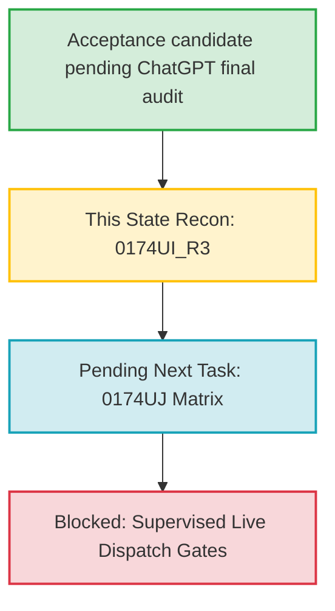

# ContentOps Current Repository State Report

## Audited Environment & Repository Metadata

- **Primary Repo Path**: `A:\Capital Chronicle\tools\cc-live-contentops`
- **GitHub Repository**: `fatcat2109/capital-chronicle-contentops`
- **Active Branch**: `master`
- **Starting HEAD**: `98a1e433836ee872d9ba6481ade1ca0ccc29eeed`
- **Final HEAD Candidate**: `6fe152c12c9c4a2599484ec62a6c9b2c9e0242dc`
- **Current Master SHA**: `6fe152c12c9c4a2599484ec62a6c9b2c9e0242dc`

---

## 1. Scope Repair & Content Validity Verification

### 0174UI_R2 + R3 ready for acceptance review
The changes made during the `0174UI_R2` repair remain fully content-valid, and the repository is ready for ChatGPT final acceptance review under `0174UI_R3` + `R4`. Key elements include:
- Rectifying the daily YouTube Data API v3 upload quota cost claim from the outdated `1600 units` to the current `1 unit in the Video Uploads quota bucket` with a limit of `100 calls per day`.
- Removing stale claims and unstable wording regarding X pricing tiers (such as "Free tier is write-only", "Basic", "Pro", and "17 tweets per 24h") and replacing them with pay-per-use credit-based pricing and 15-minute endpoint-specific rate windows.
- Restructuring and enforcing `doc_readback_basis` dictionary structures across all 10 platform references in `OfficialDocsEvidenceRef`.
- Verification via unit tests that all numeric claims enforce direct documentation proof and degrade gracefully if missing.

### Out-of-Scope Telegram Drift Restored
During the prior regression runs, the following two out-of-scope Telegram evidence files under `docs/automation/0174VF_VG_VH` were modified due to automated HEAD-matching routines:
1. `docs/automation/0174VF_VG_VH/telegram_manual_gate_backed_send_proof.md`
2. `docs/automation/0174VF_VG_VH/telegram_manual_gate_backed_send_proof_packet.json`

Both files have been restored precisely to their state at commit `c868675cbeeabf97092e1c3229583dfc54596e6b` (reverting the Start/Final/Origin HEAD identifiers to `a135e06d91d97bd448d0b711f87a1e98d1b37a33` and restoring original evidence hashes). No other files in the `0174VF_VG_VH` folder have been altered.

---

## 2. Repo Classification & Invariant Boundaries

ContentOps is strictly partitioned to avoid security leaks, unwanted side effects, or out-of-scope changes:

- **Local-Only Operational Matrix**: All contract evaluations, schemas, and local state reports are 100% network-free.
- **Credential Boundary**: Environment variable Checks are restricted to redacted presence and shape validation (e.g. format length/pattern matches). No actual credential loading or hydration happens in these tasks.
- **Provider & Platform Gates**: Disabled by default. No network calls or active token exchanges are permitted.
- **Ingestion Repository Isolation**: The core ingestion repo remains untouched; no mutations are propagated out of the local workspace.

---

## 3. Accepted / Pending / Blocked Task Chain

* **Acceptance candidate pending ChatGPT final audit**: `0174U0` through `0174UI` (with `0174UI_R2` numeric repair + R3 scope repair is ready for acceptance review). All contract schemas, tests, and regenerated documentation packets pass.
* **Pending / Next Step**: `TASK_CONTENTOPS_0174UJ_PLATFORM_PERMISSION_SCOPE_AND_APP_REVIEW_GATE_MATRIX_V0`.
* **Blocked**: Any task attempting to execute active live postings, live API reads, credential extraction, or provider integrations prior to completing the gated roadmap phases.

---

## 4. Key Platform Caveats & Grounding

1. **YouTube**:
   - Quota Cost: 1 unit per upload (Video Uploads bucket).
   - Maximum File Size: 256GB.
   - Quota Impact: 100 uploads per day.
   - MIME Types: `video/*`, `application/octet-stream`.
2. **X / Twitter**:
   - Pricing: Pay-per-use credit-based pricing model.
   - Limits: Endpoint-specific rate limits commonly resetting within 15-minute windows.
3. **Substack**:
   - Grounding: Classified as `manual_export_no_api` (weak evidence strength) to ensure no false universal negative is asserted.
4. **Telegram**:
   - Channel: Character limit is exactly 4096. Rate limits are handled by future rate matrices rather than static main-page assertions.
