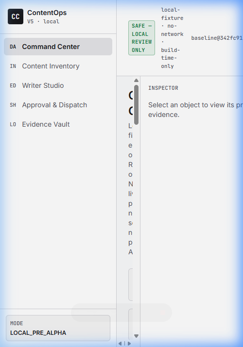
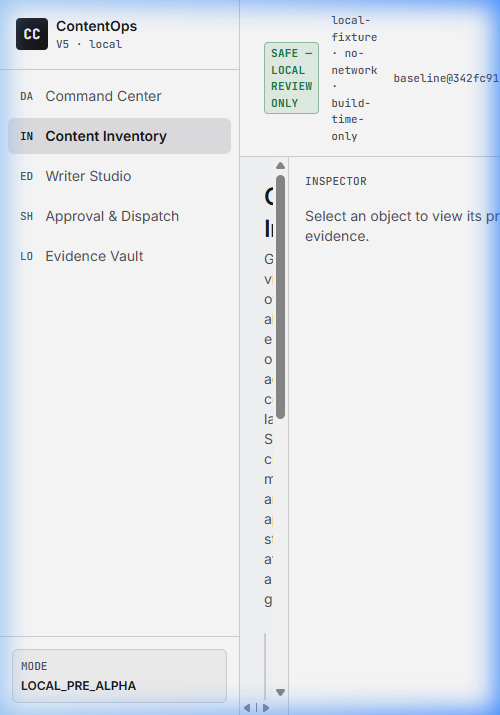
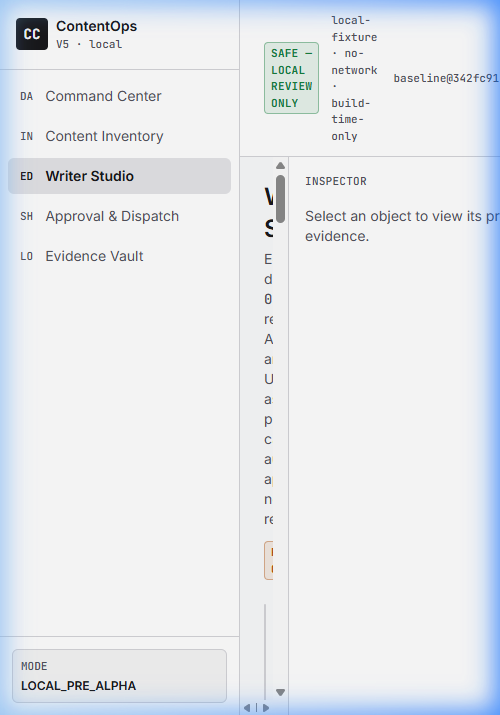
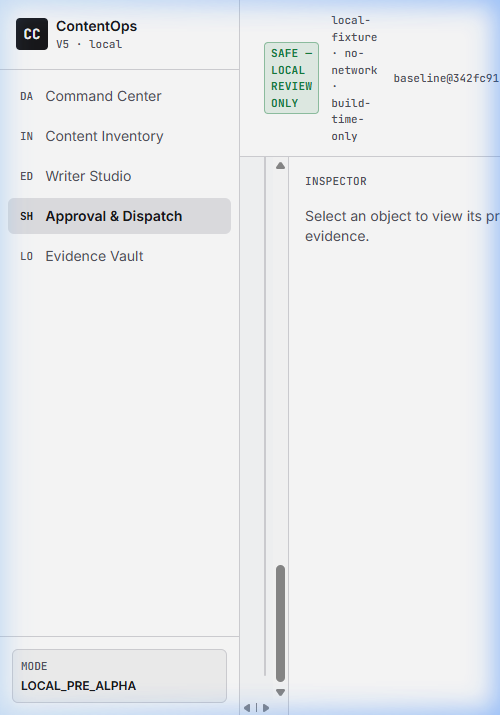
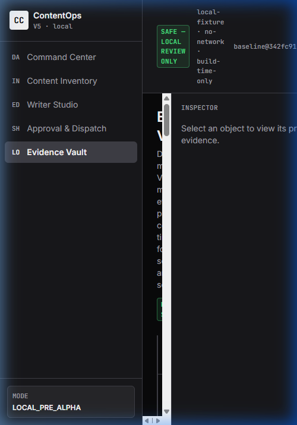

# ContentOps V5 — Browser QA Baseline (0174BZ_A)

Task: `TASK_CONTENTOPS_0174BZ_A_V5_STATIC_SAFETY_GUARDS_AND_BROWSER_BASELINE_QA_V0`

> [!NOTE]
> This is a **baseline** browser QA pass to verify the V5 foundation renders,
> stays local-first, and exposes no live/post/schedule/API controls. It is
> **not** a final visual sign-off. **Ready for ChatGPT visual audit.**

## Environment

| Field | Value |
|---|---|
| Dev server | `npm run dev` (Vite 5.4.11) |
| URL | `http://localhost:5173/` (localhost only) |
| Viewport | 1440 x 900 (desktop) |
| Build | `tsc -b && vite build` — passing |
| Tests | `vitest run` — 36/36 passing (5 smoke + 31 safety) |

## Views inspected

| View | Route (nav id) | `<h1>` heading | Screenshot |
|---|---|---|---|
| Command Center | `nav-command_center` | "Command Center" | `command_center.png` |
| Content Inventory | `nav-content_inventory` | "Content Inventory" | `content_inventory.png` |
| Writer Studio | `nav-writer_studio` | "Writer Studio" | `writer_studio.png` |
| Approval & Dispatch | `nav-approval_queue` | "Approval & Dispatch Control" | `approval_dispatch.png` |
| Evidence Vault | `nav-evidence_vault` | "Evidence Vault" | `evidence_vault.png` |

## Screenshots

## Observations

- All five flagship views are present and routable via the left nav.
- Each view renders cleanly at desktop width: no unstyled flashes, no
  overlapping text, no broken layout, no missing-font fallback observed.
- Theme: default light institutional theme; Evidence Vault forces
  `dark-evidence` mode (background turns dark, theme toggle disabled).

## Safety confirmations (visual)

- **No live/post/schedule/API controls enabled.** Approval & Dispatch shows
  `DISPATCH DISABLED` and `FUTURE-GATED` badges; the "Dispatch to platform"
  action is a disabled locked button with reason "No platform/provider API.
  Live dispatch is future-gated and globally disabled by policy."
- **AI Writer / SEO are UI-only.** Writer Studio labels them review-only with
  "no provider call, no autonomous approval, not public-ready"; AI variants are
  marked `publish_ready: false`.
- **Media Tray is mock-only.** Labeled "MOCK ONLY — UI mock. No real file
  picker, read, or upload." No `<input type="file">` rendered.
- **Local-first.** Served from localhost; static scan confirms no runtime
  network, CDN, remote font, storage, credential, or platform/provider API use.

## V4 isolation

- No files under `ui/institutional_operator_cockpit_v4/**`,
  `ui/institutional_shell/**`, `live_contentops/**`, or `schemas/**` were
  modified. All work is confined to `ui/contentops_v5/**` and this QA folder.

## Verdict

Baseline render and safety checks pass. **Not a final visual PASS — ready for
ChatGPT visual audit.**
