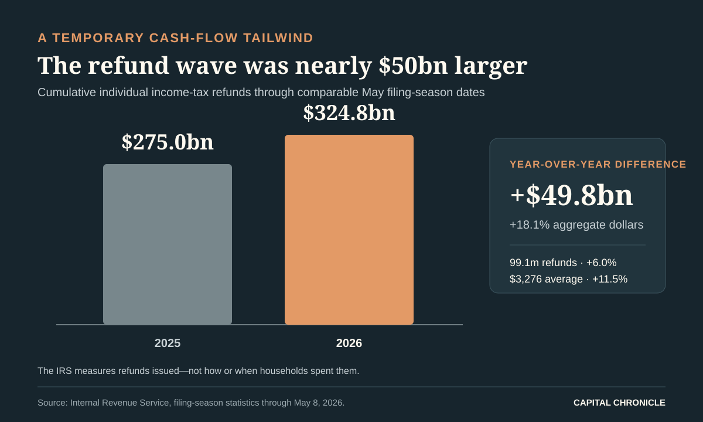
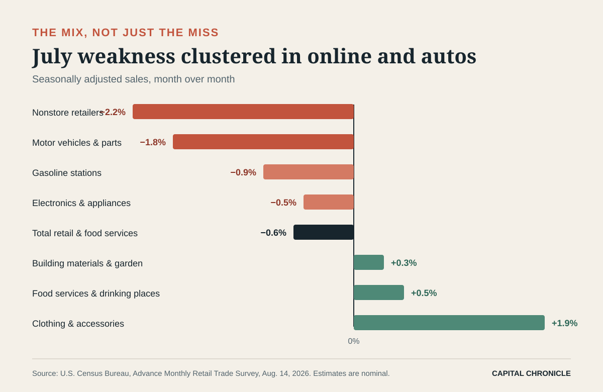

# The Refund Mirage Just Cleared—and the Fed’s Consumer Signal Got Murkier

*July retail sales fell 0.6% as an unusually large tax-refund wave faded. The mix says “payback,” not yet “collapse”—and gives the Federal Reserve reasons to resist both a hike and a premature cut.*

**By Capital Chronicle · August 15, 2026 · Research cutoff: August 15, 2026, Asia/Saigon**

The American consumer did not fall off a cliff in July. But the fiscal scaffolding underneath spring spending did.

[Retail and food-services sales fell 0.6%](https://www.census.gov/retail/sales.html) from June, the sharpest monthly decline in more than a year. The drop was large enough to be statistically significant in the Census Bureau’s advance survey, and it arrived against expectations for a small increase. Yet the details look less like a synchronized household retreat than the unwinding of an unusually favorable calendar: a much larger tax-refund season, June’s earlier Amazon Prime Day and auto promotions all pulled demand forward.

That distinction matters for the Federal Reserve. A one-month reversal after temporary support is not the same thing as a durable contraction. It is also not benign when inflation is still 3.4%, energy prices are 14.7% above a year ago, and three members of the policy committee have already split from the majority in favor of a rate increase.

The clean read is uncomfortable: underlying consumption is cooling, but the data do not yet grant the Fed permission to declare victory on inflation.

## A $49.8 billion tailwind does not recur every month

By May 8, the IRS had issued [$324.757 billion in refunds](https://www.irs.gov/newsroom/filing-season-statistics-for-week-ending-may-8-2026), up 18.1% from the comparable point in 2025. That was $49.778 billion more cash returned to households. The number of refunds rose 6.0%, while the average refund increased 11.5% to $3,276.

Those are not small differences. The incremental refund dollars were equivalent to about 6.5% of one month’s July retail and food-services sales. That comparison is scale, not causality: the IRS reports refunds issued, not the share spent, saved or used to pay debt, and not the month in which recipients deployed them. Still, contemporaneous reporting from the [Associated Press](https://apnews.com/article/retail-inflation-consumer-sentiment-economy-3e2bc5807d7396b8e6c5f599941cb2a9) identified refunds as a lift to April and May spending. By July, that cash-flow impulse was inevitably fading.

This is the first trap in the July report: comparing the post-refund month with the refund-supported spring can exaggerate the apparent break. The second is June’s event calendar. Amazon shifted its four-day Prime Day into late June, according to AP, while automakers used promotions to boost vehicle sales. Both created a high base for July.

In other words, some of the weakness was borrowed from July before July began.

## The consumer split, category by category

The $4.47 billion decline in seasonally adjusted sales—from $768.07 billion in June to $763.60 billion in July—was concentrated in precisely those high-base categories.

Nonstore retailers fell 2.2%, the largest decline among the major groups. Motor-vehicle and parts dealers dropped 1.8% after a June increase. Electronics and appliance stores declined 0.5%. Gasoline-station receipts fell 0.9%, but the Census figures measure dollars, not gallons, so they cannot support a claim about fuel volumes.

Strip out vehicles and gasoline and sales were down a milder 0.2%. The standard “control group” used in consumption calculations fell 0.4%, according to AP. Neither number is strong, but both are less dramatic than the headline.

The areas that held up are equally important. Clothing-store sales rose 1.9%. Furniture and home furnishings gained 0.3%, as did building-material and garden dealers. Food services and drinking places—the report’s one services category—rose 0.5%.

That mix argues against a simple consumer-recession headline. It points instead to a selective household: willing to spend on meals and some physical categories, but less willing—or less able—to repeat June’s large online and auto purchases. For retailers, that usually means the next contest is not traffic alone. It is how much promotion is required to convert traffic into sales, and what that does to gross margin.

## Softer receipts, still-sticky prices

The Census report is nominal: it adjusts for seasonality and calendar effects, but not inflation. July’s [consumer price index rose 0.1%](https://www.bls.gov/news.release/cpi.nr0.htm) from June and 3.4% from a year earlier. Core CPI rose 0.2% on the month and 2.5% over the year.

It would be wrong to subtract CPI mechanically from retail sales. The baskets, weights and coverage are different, and retail sales omit most services. Directionally, however, a 0.6% decline in nominal receipts during a month of slightly higher consumer prices is harder to dismiss as a price illusion.

The inflation mix is also awkward for policy. Energy prices fell 1.5% in July but remained 14.7% above a year earlier. Shelter rose only 0.1% on the month, while services excluding energy rose 0.2%. The headline rate has retreated from May’s shock-driven peak, but 3.4% is still far above the Fed’s 2% objective.

That leaves households with a two-speed squeeze. Goods disinflation is improving in places, but the cumulative price level remains high and energy’s year-over-year increase still absorbs cash. July retail softness may be partly a normalization after refunds; it may also be the first clean glimpse of what discretionary demand looks like without that cushion.

## Why the Fed should read this as a pause signal

At its July 29 meeting, the [Federal Open Market Committee held the federal-funds target at 3.5%–3.75%](https://www.federalreserve.gov/newsevents/pressreleases/monetary20260729a.htm) by a 9–3 vote. Beth Hammack, Neel Kashkari and Lorie Logan dissented in favor of a quarter-point increase. The statement said inflation remained elevated and emphasized the price effects of supply shocks, including energy.

July retail sales weaken the case for an immediate hike. They do not establish a case for an immediate cut.

The broader growth data are too resilient for that. [Real GDP rose at a 1.5% annualized rate](https://www.bea.gov/news/2026/gdp-advance-estimate-2nd-quarter-2026) in the second quarter, down from 2.1% in the first. But real final sales to private domestic purchasers—a cleaner view of household demand and fixed investment—accelerated to 3.9% from 1.7%. Consumer spending increased in both goods and services.

So the Fed faces three signals that refuse to line up neatly:

- July retail says the consumer lost momentum as temporary supports faded.
- Q2 private demand says the domestic economy entered the summer with real strength.
- July CPI says inflation is easing at the margin but remains above target, with energy still a major year-over-year pressure.

That combination rewards waiting for confirmation. It also raises the hurdle for the hawks: another hike would need evidence that inflation persistence is spreading beyond the energy shock, not merely that the 12-month headline remains high. Conversely, doves need proof that July’s sales decline is the start of a broader labor-income and consumption slowdown, not calendar payback.

> **CAPITAL CHRONICLE ANALYSIS — OUR VIEW**
> The refund wave made spring demand look stronger; July’s payback makes the slowdown look sharper. Policy should respond to the trend between those distortions, not either endpoint.

## The September decision gets one last-minute receipt

The next policy meeting falls on September 15–16. August CPI is scheduled for September 11. In an unusual timing collision, the Census Bureau plans to release August advance retail sales at 8:30 a.m. on September 16—hours before the Fed’s decision.

Three tests will matter:

1. **Breadth.** If August weakness spreads from online and autos into restaurants, general merchandise and other categories, the July report will look less like payback.
2. **Income confirmation.** Retail covers goods and food services, not the full consumer. July personal income and outlays, due August 26, will show whether broader real consumption slowed and whether the saving rate absorbed some of the refund windfall.
3. **Inflation transmission.** If energy pressure continues to fade without reappearing in core goods or services, the three July hike dissents will become harder to sustain. A renewed core acceleration would reverse that conclusion quickly.

For investors, the first-order message is not “consumer broken.” It is “consumer normalization is no longer hidden by fiscal timing.” That favors businesses with repeat demand, low promotional dependence and room to protect margins. It is less friendly to retailers whose June volume was bought with discounts or event-driven pull-forward.

For rates, July removes some upside growth risk but does not erase inflation risk. The bond market may want a directional verdict; the data offer a waiting room.

The refund mirage has cleared. What remains is a consumer still spending, but choosing more carefully—and a Fed that now needs the next month of evidence more than it needs a stronger adjective.

---

*Methodology: Retail figures are seasonally adjusted, nominal advance estimates from the Census Bureau and are subject to revision. Refund figures are cumulative IRS filing-season statistics through May 8, 2026. CPI and GDP figures come from BLS and BEA releases available by the research cutoff. Capital Chronicle analysis is interpretation, not a quotation or statement from any photographed official.*
