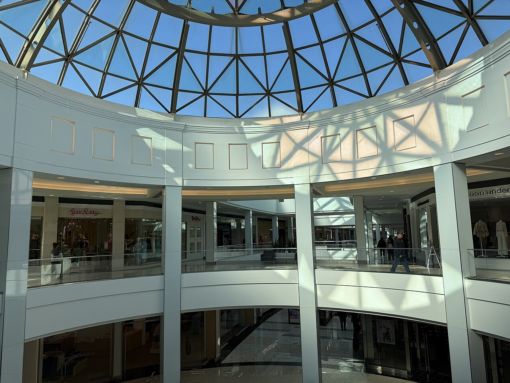
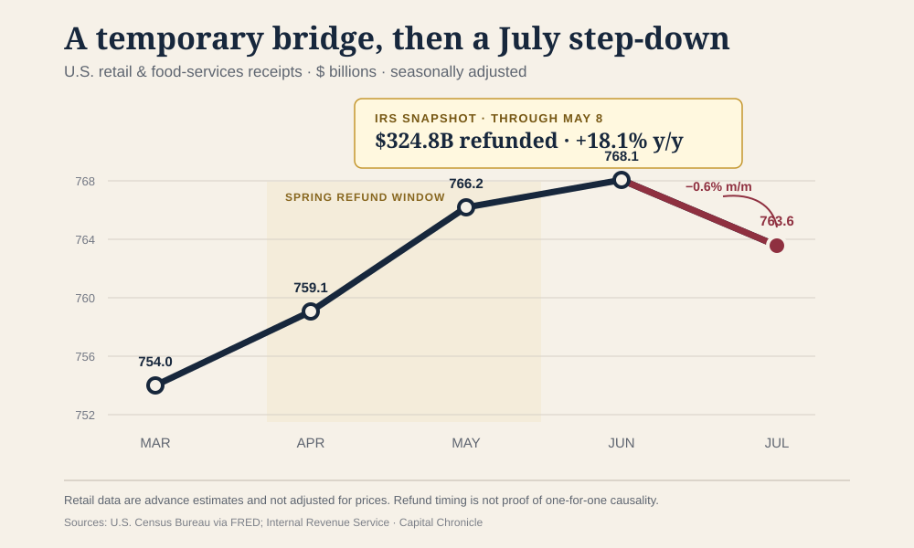
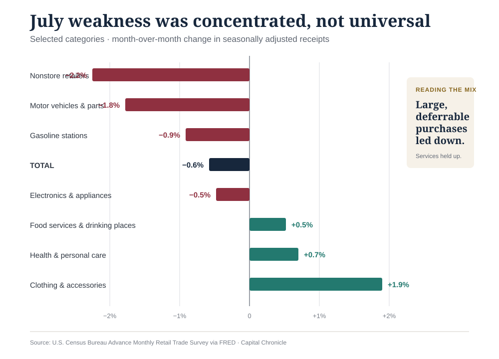
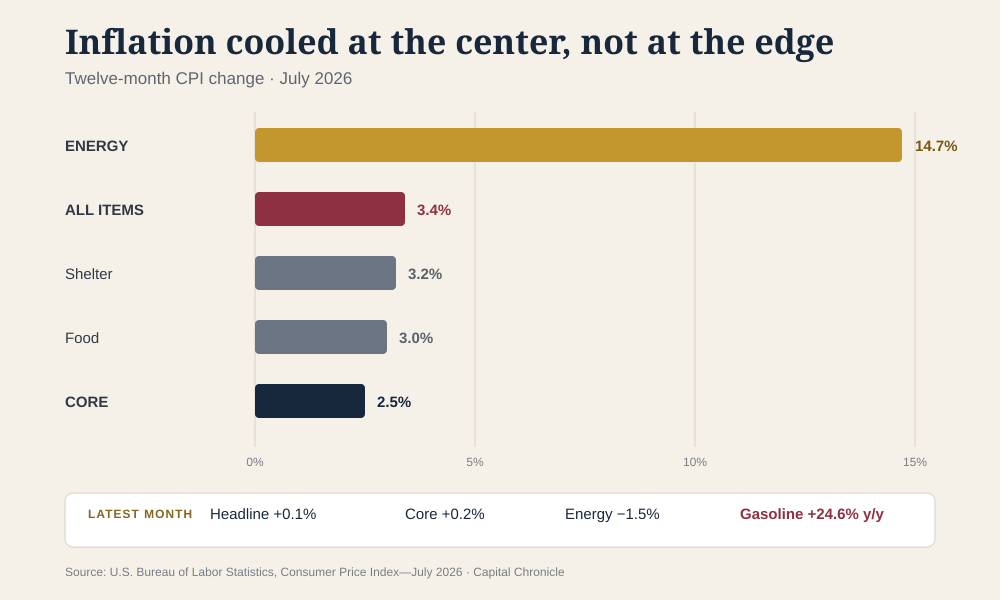
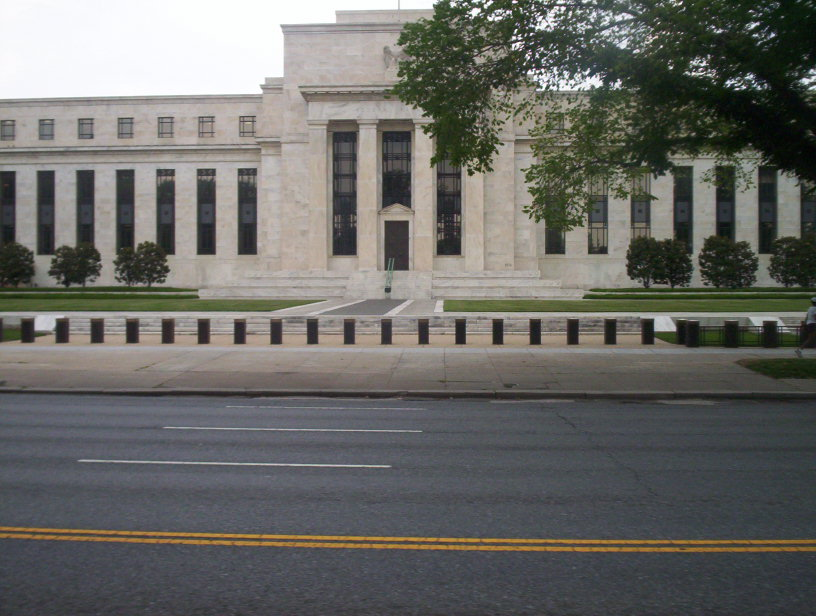

# The Refund Tide Went Out. Now the Fed Has to Read the Consumer Without It

*July retail receipts fell 0.6% as online and auto spending reversed. Inflation cooled but energy prices stayed hot, leaving the Federal Reserve with a narrower case for action in either direction.*

**By Capital Chronicle · August 15, 2026 · U.S. Economy · Capital Chronicle Analysis**

*The Nordstrom court at King of Prussia Mall in Pennsylvania, photographed February 4, 2026. Photo: Dough4872/Wikimedia Commons, [CC BY-SA 4.0](https://creativecommons.org/licenses/by-sa/4.0/). Cropped for presentation.*

The American consumer did not fall off a cliff in July. It stepped off a temporary bridge.

Advance U.S. retail and food-services receipts were a seasonally adjusted **$763.6 billion**, down **0.6% from June**—the first monthly decline in nine months—and still **5.0% above July 2025**, according to [Census Bureau data distributed by the Federal Reserve Bank of St. Louis](https://fred.stlouisfed.org/series/RSAFS). These are advance estimates, and they are not adjusted for price changes.

The composition makes the headline more useful. The pullback was led by nonstore retailers and motor vehicles, two large categories that had enjoyed unusually favorable timing in June. Restaurants, clothing stores and several home-related categories advanced. That is not a clean recession signal. It is evidence of a consumer becoming more selective after a spring cash injection and a promotion-heavy start to summer.

For the Federal Reserve, that distinction is the story. July weakens the argument that demand can absorb another rate increase without strain. It does not, by itself, create a case for a cut while headline inflation is 3.4%, energy inflation is in double digits and second-quarter domestic demand was still firm. The latest data point toward patience—not because the economy is uneventful, but because its signals now disagree in precisely the way that punishes a rushed decision.

## A nearly $50 billion bridge

The tax-refund numbers were large enough to change the texture of the spring.

By May 8, the Internal Revenue Service had issued **$324.757 billion** of refunds for the 2026 filing season, compared with **$274.979 billion** at the comparable point in 2025. That is **$49.778 billion more**, or an **18.1%** increase. The number of refunds was up **6.0%**, while the average refund rose **11.5% to $3,276**, according to the [IRS filing-season statistics](https://www.irs.gov/newsroom/filing-season-statistics-for-week-ending-may-8-2026).

Retail receipts rose from $754.0 billion in March to $766.2 billion in May and $768.1 billion in June before retreating to $763.6 billion in July. The timing supports a straightforward reading: larger refunds helped households bridge higher prices and bring some purchases forward, then that support faded.

It does **not** prove that refunds caused every dollar of the spring gain. The IRS figures are cumulative; retail sales are monthly. Households can save refunds, repay debt or spend them outside the retail categories. Auto incentives, the World Cup and the shift of Amazon's Prime Day into late June also affected timing. The defensible conclusion is narrower: refunds were a meaningful temporary tailwind, and July is the first clean look at demand after much of that tailwind had passed.

*Sources: U.S. Census Bureau via FRED; IRS filing-season statistics through May 8, 2026. Retail figures are seasonally adjusted and not price-adjusted. The overlap is evidence of timing, not proof of a one-for-one causal relationship.*

## The consumer mix says “budgeting,” not “bunker”

Nonstore retailers, which include online sellers, recorded the largest major-category decline in July: **2.2%**. Motor-vehicle and parts dealers fell **1.8%**, gasoline-station receipts fell **0.9%**, and electronics and appliance stores slipped **0.5%**. The retail control group used in estimating goods consumption in GDP—excluding autos, gasoline, building materials and food services—fell **0.4%**, according to [Associated Press reporting](https://apnews.com/article/retail-inflation-consumer-sentiment-economy-3e2bc5807d7396b8e6c5f599941cb2a9) on the Census release.

Two cautions matter. First, the Census survey measures receipts, not physical units. A decline at gasoline stations cannot be translated into a claim about gasoline volume without separate volume evidence. Second, June comparisons were distorted by promotion timing: Prime Day began in late June, and auto incentives helped lift vehicle receipts that month.

The other side of the ledger is harder to square with a broad consumer retreat. Clothing-store receipts rebounded **1.9%**. Health and personal-care stores gained **0.7%**. Food services and drinking places—the only services category in the retail report—rose **0.5%** after a 0.4% June gain. Furniture, building-material and general-merchandise stores also edged higher in the [official category data](https://fred.stlouisfed.org/release/tables?eid=201241&rid=9).

That pattern looks like prioritization. Households cut large, postponable and promotion-sensitive purchases while continuing to spend on meals out, back-to-school clothing and selected household needs. A consumer in a bunker cancels broadly. A consumer on a budget chooses.

*Source: U.S. Census Bureau Advance Monthly Retail Trade Survey via FRED. Percent changes are calculated from published June and July seasonally adjusted receipts; values may differ from headline rounding.*

The report is also narrower than the consumer economy. It captures mostly goods and only one service category; it does not cover hotel stays, most travel, health services or financial services. That matters because the [Bureau of Economic Analysis](https://www.bea.gov/news/2026/gdp-advance-estimate-2nd-quarter-2026) found that second-quarter consumer spending increased in both goods and services. Real GDP grew at a **1.5% annualized rate**, slower than the first quarter's 2.1%, but real final sales to private domestic purchasers accelerated to **3.9%** from 1.7%.

July therefore starts the third quarter on a softer note. It does not rewrite the second quarter, and one advance retail estimate is not a trend.

## Inflation cooled in the middle—and stayed hot at the edge

The July inflation report is encouraging until it is treated as permission.

The Consumer Price Index rose **0.1% in July** and **3.4% over 12 months**, down from 3.5% in June. Core CPI, excluding food and energy, rose **0.2% on the month** and **2.5% over the year**, matching its post-pandemic low. Shelter rose only 0.1% in July. Those are the figures that give the Fed room to wait.

The distribution removes room to relax. Energy prices fell 1.5% in July but remained **14.7% above a year earlier**; gasoline was **24.6% higher**. Food was up 3.0% over 12 months and shelter 3.2%. The [BLS release](https://www.bls.gov/news.release/pdf/cpi.pdf) also showed monthly increases in medical care, airfares, communication, education and recreation.

*Source: U.S. Bureau of Labor Statistics, Consumer Price Index—July 2026. The energy bar includes a large gasoline contribution; year-over-year rates can remain high even when the latest monthly change is negative.*

This is why the 5.0% year-over-year gain in retail receipts should not be presented as a 5.0% increase in purchasing power. Retail sales are nominal and their category weights do not match the CPI basket. Simply subtracting headline CPI would manufacture a “real retail sales” figure that neither agency publishes.

The broader price backdrop is similarly awkward. BEA's advance estimate put the second-quarter PCE price index at a **5.1% annualized rate** and core PCE at **3.4%**, even as July's CPI showed cooler momentum. The economy is not sending one inflation signal; it is sending a hot quarterly history and a cooler monthly update.

## The Fed's burden of proof has shifted

On July 29, the Federal Open Market Committee held the federal-funds target at **3.50%–3.75%** by a **9–3 vote**. Beth Hammack, Neel Kashkari and Lorie Logan dissented in favor of a quarter-point increase. The [official statement](https://www.federalreserve.gov/newsevents/pressreleases/monetary20260729a.htm) called inflation elevated relative to the 2% goal and specifically cited energy-related supply shocks.

Kevin Warsh, who became Fed chair on May 22, told Congress in July that the committee had “no tolerance for persistently elevated inflation.” The leadership transition matters less than the reaction function it has made explicit: this Fed will want evidence that softer inflation is durable, not simply a favorable month.

*The Marriner S. Eccles Federal Reserve Board Building. Photo: TheAgency/CJStumpf via Wikimedia Commons, [CC BY-SA 3.0](https://creativecommons.org/licenses/by-sa/3.0/). Cropped for presentation.*

> **CAPITAL CHRONICLE ANALYSIS**
>
> July changes the burden of proof. An immediate hike now requires evidence that inflation is reaccelerating beyond energy while demand remains resilient. A cut requires evidence that weakness is spreading beyond online shopping and autos into services, hiring and incomes. Until one side clears that bar, holding rates is the decision most consistent with the data.

That is not a forecast that the Fed will be inactive indefinitely. It is a map of what would make action coherent.

- **The case for a hike strengthens** if core monthly inflation reaccelerates, energy costs spill into a broader set of prices, and the July retail decline reverses without labor-market damage.
- **The case for a cut strengthens** if retail weakness broadens, services spending and hiring cool, and core inflation continues to run near a 0.2% monthly pace.
- **The case for another hold survives** if the present split persists: softer discretionary goods demand, still-positive services spending, cooler core inflation and elevated supply-driven headline inflation.

The July retail report did not prove that the consumer is broken. It showed that the consumer looks different when a temporary cash cushion disappears. That makes the next set of data more important, not less: the Fed must distinguish a normalization after refunds and promotions from the start of a broader retrenchment.

For now, the strongest conclusion is the least theatrical one. The refund tide went out; the economy is still standing; and the central bank has no reason to sprint in either direction.

---

### Primary sources and methodology

- [U.S. Census Bureau, Monthly Retail Trade sales report](https://www.census.gov/retail/sales.html), July 2026 data released August 14, 2026.
- [U.S. Census Bureau retail series and category table via FRED](https://fred.stlouisfed.org/release/tables?eid=201241&rid=9), updated August 14, 2026.
- [IRS filing-season statistics through May 8, 2026](https://www.irs.gov/newsroom/filing-season-statistics-for-week-ending-may-8-2026).
- [BLS, Consumer Price Index—July 2026](https://www.bls.gov/news.release/pdf/cpi.pdf), released August 12, 2026.
- [Federal Reserve, July 29, 2026 FOMC statement](https://www.federalreserve.gov/newsevents/pressreleases/monetary20260729a.htm).
- [Federal Reserve, Chair Kevin Warsh's July 14 testimony](https://www.federalreserve.gov/newsevents/testimony/warsh20260714a.htm).
- [Federal Reserve, official biography of Chair Kevin Warsh](https://www.federalreserve.gov/aboutthefed/bios/board/warsh.htm).
- [BEA, advance estimate of second-quarter 2026 GDP](https://www.bea.gov/news/2026/gdp-advance-estimate-2nd-quarter-2026), released July 30, 2026.
- [Associated Press, retail-sales report](https://apnews.com/article/retail-inflation-consumer-sentiment-economy-3e2bc5807d7396b8e6c5f599941cb2a9), August 14, 2026.
- [Associated Press, July inflation report](https://apnews.com/article/consumer-prices-inflation-fed-interest-rates-150e179a6c6b3182ba05cedf0188394b), August 12, 2026.

*Research cutoff: August 15, 2026, Asia/Saigon. Analysis is Capital Chronicle's and is not a quotation or investment recommendation. Advance and seasonally adjusted data are subject to revision.*
