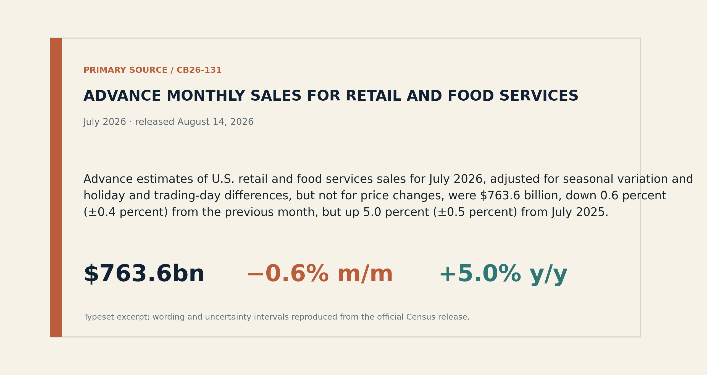
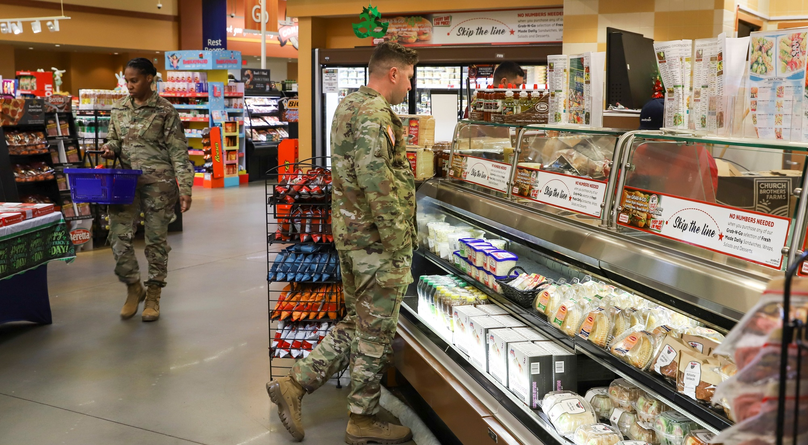
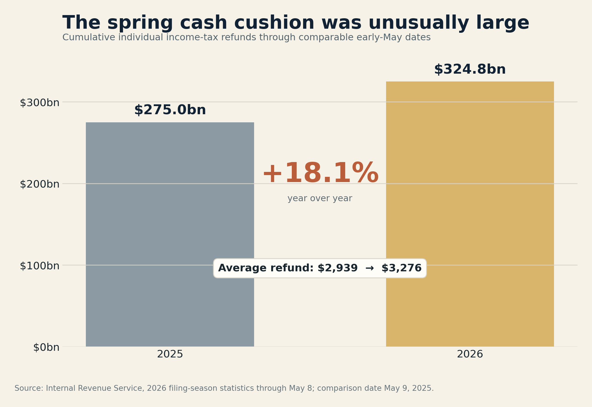
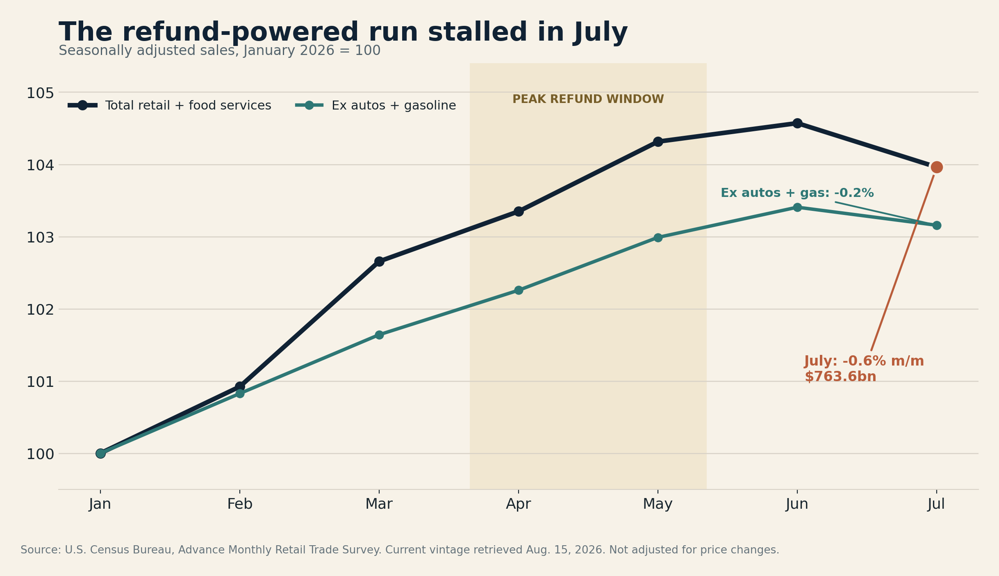
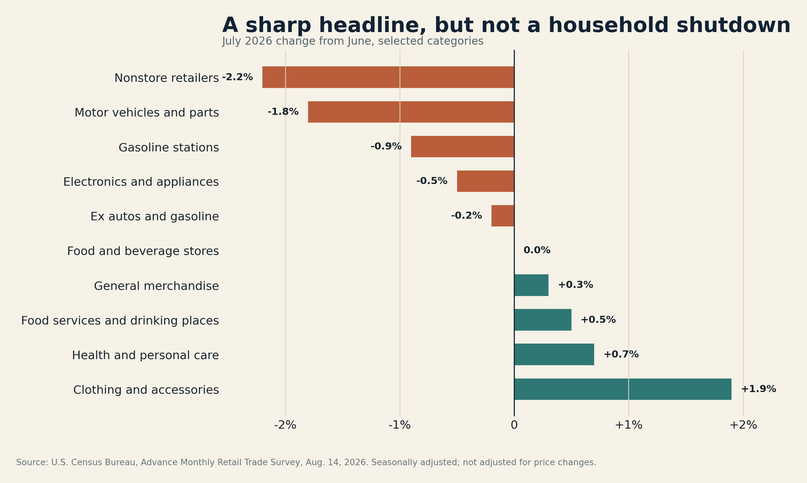

# The consumer didn’t fall off a cliff. The refund bridge just ended.

*July retail sales dropped 0.6% as tax-refund cash and June’s promotion calendar faded. The mix—autos and e-commerce down, restaurants still up—argues for a slower third quarter, not household capitulation. For the Warsh Fed, that is awkwardly close to the desired outcome.*

**By Capital Chronicle Editorial Desk** · August 15, 2026 · Macro & Markets

U.S. retail sales turned lower in July after a strong first half. The headline was bracing: sales fell 0.6% from June to a seasonally adjusted $763.6 billion, the largest monthly decline since May 2025 and far below the small increase economists had expected.[^census] [^axios] [^apcurrent]

The easy interpretation is that the American consumer—the economy’s habitual last line of defence—has cracked. It is also too neat.

The July report looks less like a household shutdown than the end of a temporary bridge. A record-sized tax-refund season had put unusually large amounts of cash into bank accounts just as higher energy costs were squeezing budgets. June then captured major online promotions that would normally have landed in July. When both supports faded, the monthly comparison turned ugly.

That distinction matters. A cliff calls for recession positioning. A bridge ending calls for a more selective response: lower third-quarter consumption estimates, more scrutiny of retailers’ promotional dependence and continued caution from a Federal Reserve that is still fighting above-target inflation.

*Primary source: U.S. Census Bureau release CB26-131. The advance estimate is seasonally adjusted but not adjusted for price changes; its reported 90% margin of sampling error for the monthly move is ±0.4 percentage point.*

*Soldiers shop at the Fort Belvoir Commissary in Virginia. The 2023 image is documentary context, not a depiction of July 2026 activity. Courtesy Defense Commissary Agency via DVIDS; public domain. The appearance of U.S. Department of War visual information does not imply or constitute endorsement.*

## The IRS was part of the consumer story

The Internal Revenue Service does not usually appear in consumer-discretionary strategy decks. This year it should.

By May 8, the IRS had issued $324.757 billion of individual income-tax refunds, up 18.1% from $274.979 billion at the comparable point in 2025. The average refund rose to $3,276 from $2,939. In aggregate, that was nearly $49.8 billion more cash returned to households than a year earlier.[^irs]

Not every refunded dollar was spent, and the timing of an IRS payment is not the timing of a retail transaction. But the scale is large enough to explain why spring consumption could remain firm even as gasoline prices and other costs rose. Professional reporting in April and May identified the refund wave as an important support for sales—and warned that the support would taper.[^april] [^may]

July is the first clean look at demand after that flow had largely passed.

The monthly sales path is consistent with that sequence. Total retail and food-service sales rose through June, then fell in July. Sales excluding autos and gasoline also eased, but by a much smaller 0.2%. The bridge ended; the road did not disappear.

## The mix is weaker than the optimists want—and better than the pessimists need

Two categories did much of the damage. Nonstore retailers, which include e-commerce, fell 2.2% from June. Motor-vehicle and parts dealers fell 1.8%. Gasoline-station receipts declined 0.9%, consistent with lower pump prices during the month rather than necessarily fewer gallons sold.[^census]

Those moves are not trivial. Online spending has been one of the consumer economy’s most reliable growth channels, and autos are a large, financing-sensitive purchase. But July also contained evidence against indiscriminate retrenchment:

- Sales excluding autos and gasoline slipped 0.2%, one-third of the headline decline.
- Food-service and drinking-place receipts rose 0.5%.
- Clothing and accessories sales rose 1.9%, consistent with an early back-to-school rotation.
- General-merchandise sales increased 0.3%, while food-and-beverage stores were flat.

Restaurants are especially useful here. They are the report’s only services category and one of the first places households can economise without renegotiating a mortgage or selling a car. Continued growth is not proof of strength, but it is difficult to square with a consumer already in full retreat.

The right conclusion is not “nothing to see.” Even after stripping out autos and gasoline, sales fell. June’s online promotions explain part of the e-commerce reversal, but they cannot explain every soft category. Consumers appear more deliberate, more price-sensitive and less able to rely on a fresh cash buffer.

That is a downshift. It is not yet a stall.

## Nominal dollars are doing some flattering

Retail sales were still 5.0% above July 2025. That sounds reassuring until one remembers what the series measures: dollars collected, not the volume of goods carried out of stores.

Consumer prices were 3.4% higher than a year earlier in July. Core inflation was 2.5%, while the energy index was 14.7% higher.[^bls] The retail and CPI baskets are different, so subtracting one rate from the other would manufacture a false “real retail sales” estimate. The valid conclusion is narrower: a meaningful portion of the annual sales increase reflects higher prices, and the 5.0% nominal gain should not be read as a 5.0% increase in physical demand.

This is where the July report becomes more important for corporate earnings than for recession calls. Retailers can preserve revenue while losing unit volume, then discover the damage in gross margin when promotions are needed to keep traffic moving. The question for the second half is not simply whether consumers spend. It is how much price, discounting and mix are required to produce each dollar of sales.

## The Warsh Fed gets a reason to wait, not permission to celebrate

The Federal Reserve held its policy rate at 3.5%–3.75% on July 29. The 9–3 vote was unusually divided: three officials preferred a quarter-point increase. The statement described inflation as elevated and linked some of that pressure to energy supply shocks.[^fed]

July’s subsequent data complicate the hawkish case. Headline CPI rose just 0.1% in the month and core CPI 0.2%; retail sales then declined.[^bls] Together, those releases reduce the urgency of tightening into the September meeting.

They do not settle the argument. Inflation remains above the Fed’s 2% goal, annual energy inflation is still severe and one month of softer demand can reverse. Real GDP grew at a 1.5% annual rate in the second quarter, with consumer spending still contributing to the expansion.[^bea] The central bank is confronting moderation, not contraction.

*Federal Reserve Chair Kevin Warsh answers reporters’ questions after the June 2026 FOMC meeting. Federal Reserve photo via Flickr, public domain.*

For markets, the cleanest inference is a wider waiting zone. A September rate increase now needs stronger August inflation or activity data to overcome July’s softness. A rate cut would require a much more convincing deterioration than this report provides. “Hold” is not indecision when the data are pulling in opposite directions; it is the price of optionality.

## The counter-case: July may be mostly payback

There are three reasons not to extrapolate the 0.6% decline.

First, the advance retail estimate is noisy. Census derives it from an early sample of roughly 4,800 firms, and the reported confidence interval means the true monthly decline could plausibly be smaller or larger. The figures will be revised.[^censuspdf]

Second, promotion timing moved spending into June. When a sales event shifts across months, seasonal adjustment cannot turn the calendar back into a laboratory experiment.

Third, households continued to spend on restaurants and clothing. Those are not the choices of consumers who have collectively slammed their wallets shut.

The bear case still has a credible route. The refund impulse is gone, prices remain high, rate-sensitive purchases are weakening and even the ex-autos-and-gas measure declined. If August repeats the drop—especially across restaurants, general merchandise and other discretionary categories—the calendar defence will expire quickly.

## What will confirm the downshift

The next retail-sales release on September 16 is the decisive test. A rebound in online spending alongside stable restaurant receipts would make July look like timing payback. Another broad decline, particularly outside autos and gasoline, would turn one weak month into a trend.[^schedule]

Before then, three signals matter:

1. **Retailer margins and inventories.** Sales can hold up while profits deteriorate if promotions are doing the work.
2. **August inflation.** The September 11 CPI release will show whether July’s softer price pulse survived.
3. **Household cash behaviour.** Card spending, deposit balances and delinquency data can reveal whether the post-refund slowdown is concentrated or spreading.

The consumer did not fall off a cliff in July. The temporary bridge of larger refunds and pulled-forward promotions simply reached the other side. What comes next depends on whether wages and balance sheets can carry demand without it.

That is less dramatic than a collapse—and more consequential than a one-month statistical wobble.

---

### Sources

[^census]: [U.S. Census Bureau, Advance Monthly Sales for Retail and Food Services, July 2026](https://www.census.gov/retail/sales.html), released Aug. 14, 2026.
[^censuspdf]: [U.S. Census Bureau, official July 2026 release PDF](https://www.census.gov/retail/marts/www/marts_current.pdf), CB26-131.
[^axios]: [Axios, “Retail sales slump in July”](https://www.axios.com/2026/08/14/retail-sales-amazon-world-cup), Aug. 14, 2026.
[^apcurrent]: [Associated Press, “US retail sales fell 0.6% last month…”](https://apnews.com/article/3e2bc5807d7396b8e6c5f599941cb2a9), Aug. 14, 2026.
[^irs]: [Internal Revenue Service, filing-season statistics through May 8, 2026](https://www.irs.gov/newsroom/filing-season-statistics-for-week-ending-may-8-2026).
[^april]: [Associated Press, “Retail sales growth slowed in April…”](https://apnews.com/article/f77b8986d274c40b913c26ba39492ead), May 14, 2026.
[^may]: [Associated Press, “Retail sales up a strong 0.9% in May…”](https://apnews.com/article/090206f028b12e15038265806355d75f), June 17, 2026.
[^bls]: [U.S. Bureau of Labor Statistics, Consumer Price Index — July 2026](https://www.bls.gov/news.release/cpi.nr0.htm), released Aug. 12, 2026.
[^fed]: [Federal Reserve, July 29, 2026 FOMC statement](https://www.federalreserve.gov/newsevents/pressreleases/monetary20260729a.htm).
[^bea]: [U.S. Bureau of Economic Analysis, Q2 2026 advance GDP estimate](https://www.bea.gov/data/gdp/gross-domestic-product), released July 30, 2026.
[^schedule]: [U.S. Census Bureau, 2026 retail release schedule](https://www.census.gov/retail/release_schedule.html).

*Capital Chronicle analysis distinguishes reported facts from interpretation. This article is an owner-review artifact and has not been published.*
