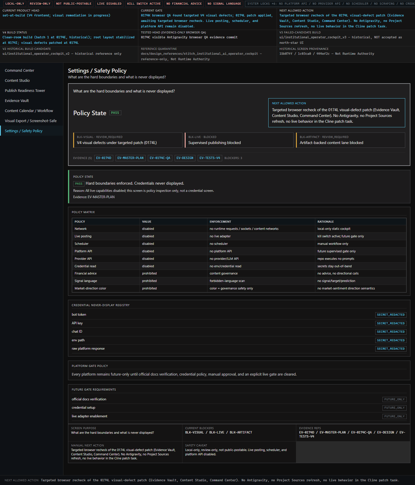
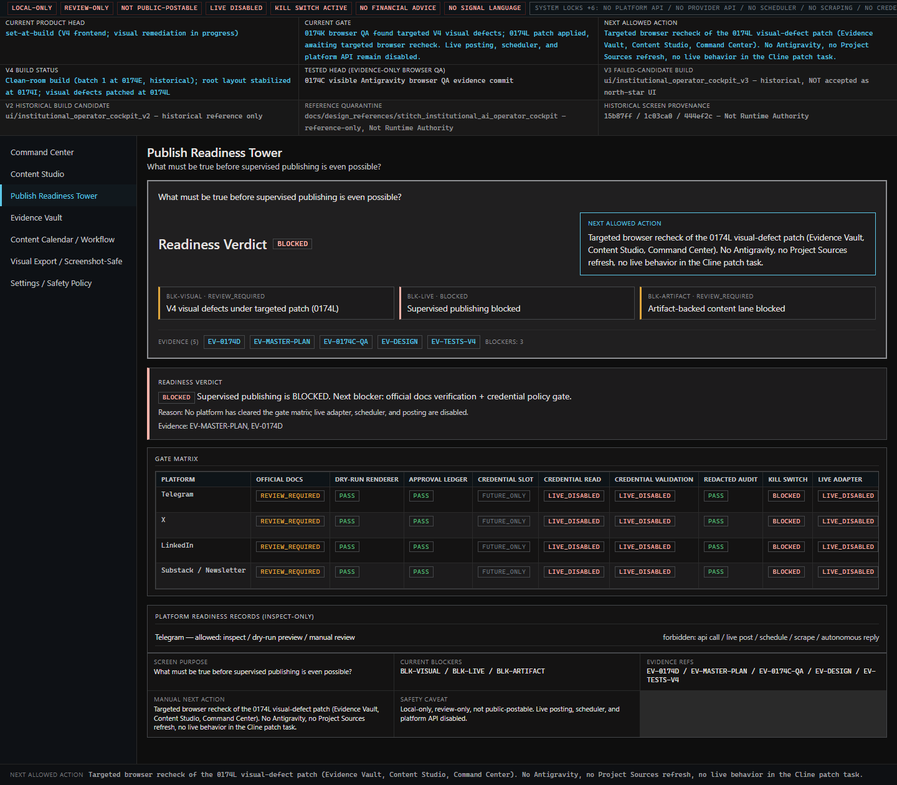
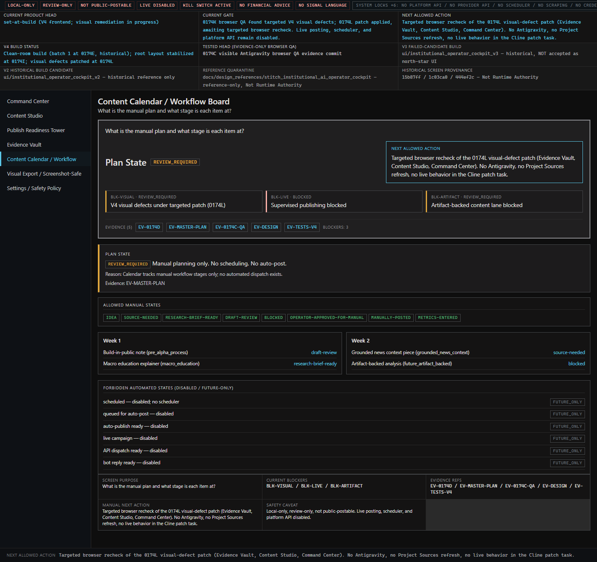
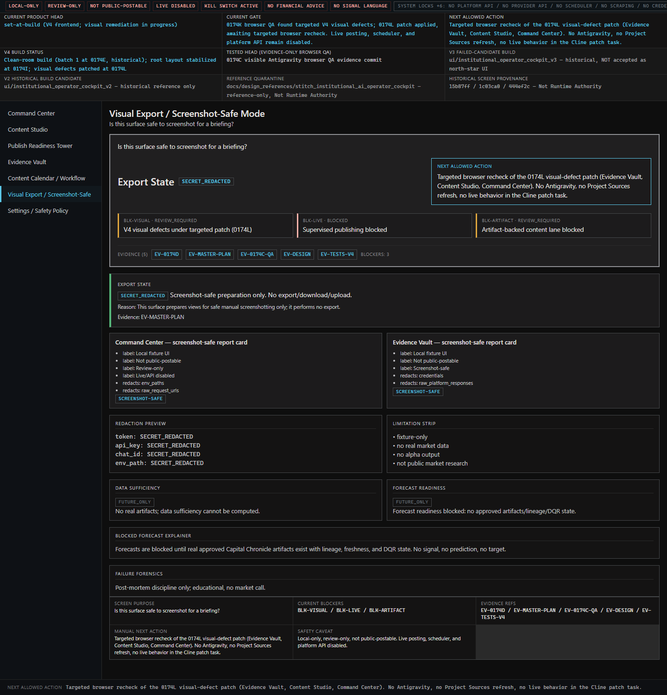

# BROWSER QA RESULT: V4_VISUAL_FAIL_TARGETED_PATCH_NEEDED

While the 0174T patch successfully implemented the new full-width "Readable Operator Scan Layer" state bands fulfilling the horizontal scanning requirements, the V4 Dashboard is **NOT** yet acceptable as a local-first institutional operator cockpit due to leftover V3 structures and data staleness. 

### OBSERVED DEFECTS FOR NEXT CLINE PATCH:

#### 1. CRITICAL: V3 Duplicate State Card Persistence (All Screens)
*   **The Defect:** The new V4 full-width State Bands (e.g., `Current Verdict [BLOCKED]`, `Studio State [REVIEW_REQUIRED]`) were inserted *above* the legacy V3 generic screen state cards, instead of replacing them. Every screen now contains two dominant state declarations. 
*   **Worse on Command Center:** The Command Center screen suffers from *triple* redundancy (Row 1: The new Band, Row 2: The old V3 Card, Row 3: A summary table repeating the same data).
*   **Violation:** The Blueprint explicitly dictates under *What Must NOT Be Reused From V3*: `The per-screen generic "screen state" card as the dominant first-fold element`. The legacy cards must be purged.

#### 2. CRITICAL: Stale Metadata / Provenance Violation (Global Header)
*   **The Defect:** The Global Header Truth Rail hardcodes stale mock data referencing past patches (`0174K browser QA found... 0174L patch applied...`). 
*   **Violation:** The Master Plan strictly forbids displaying historical metadata as current operational truth (`An institutional cockpit cannot display historical metadata in a way that looks like current operational truth`). The mock text must be updated to reflect the present state.

#### 3. MINOR: Safety Rail Truncation without Ellipsis (< 1920px)
*   **The Defect:** At viewports smaller than 1920x1080 (e.g., 1440x900, 1366x768), the top right `SYSTEM LOCKS +6: ...` chip is abruptly cut off mid-word (e.g., `NO CREDE`). 
*   **Violation:** Lack of standard graceful visual degradation (e.g., `text-overflow: ellipsis`).

---

### Visual Evidence (1440x900)

---
**Next Recommended Action:**
Proceed with ChatGPT audit, then initiate a targeted Cline CLI patch specifically instructed to fix these visual redundancies and clean the mock data.
